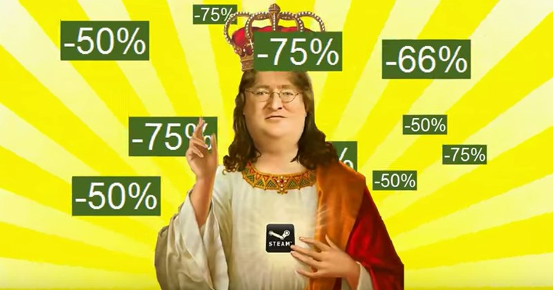

# Introdução

A Steam é a maior loja virtual para jogos de computadores, tendo atualmente mais de 100.000 itens em sua biblioteca, entre jogos e softwares alternativos, e mais de 30 milhões de usuários ativos. Criada em 2003, a plataforma da empresa Valve se popularizou tanto pelos seus títulos próprios, como os clássicos Half-Life e Portal, quanto pelo seu fácil acesso a jogos das mais diferentes empresas, desde pequenas desenvolvedoras, com menos de uma dezena de funcionários, até as grandes publishers, que movimentam centenas de milhões de dólares. Números tão altos e diversos nos fazem questionar:

- Existem padrões de escolha dos usuários da Steam?
- Se sim, quais são eles?

Essas e outras perguntas serão respondidas pela visualização de diferentes conjuntos de dados coletados sobre os jogos da steam. Para isso dividimos em três conjuntos de jogos diferentes:

- [Os jogos bem avaliados com maior número de análises.](https://lucasaraga0.github.io/steamVisualization/bemAvaliados)
- [Os jogos mais vendidos da steam.](https://lucasaraga0.github.io/steamVisualization/maisVendidos)
- [Os jogos em alta durante o mês de junho.](https://lucasaraga0.github.io/steamVisualization/emAlta)